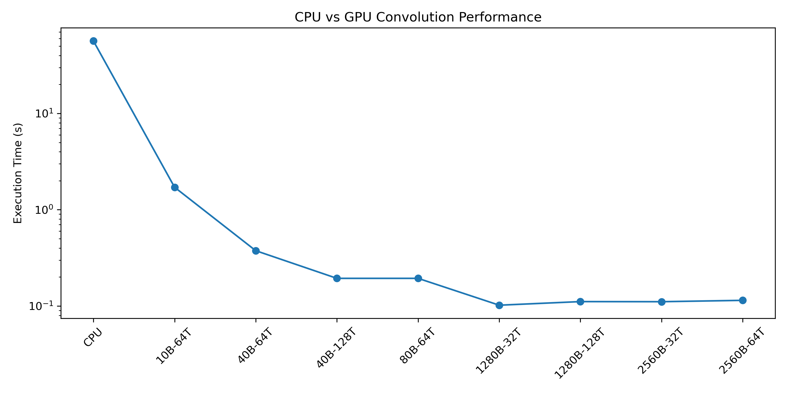
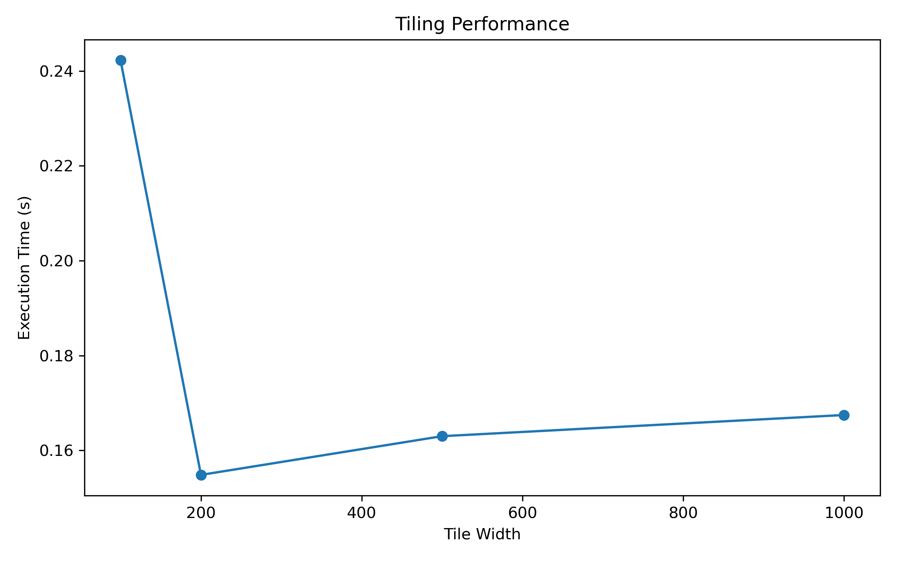

# CUDA Image Convolution

This project implements and optimizes a **2D image convolution algorithm on GPU using CUDA**, comparing performance against a CPU baseline and exploring different parallel configurations.

The focus is on **parallelization, memory access patterns, and performance optimization**, rather than on image processing itself.

---

## Overview

Convolution is a fundamental operation in image processing where each output pixel is computed as a weighted sum of its neighboring input pixels.

This project includes:
- a **CPU implementation** (serial baseline),
- a **GPU implementation using CUDA**,
- an optimized **tiled GPU version using shared memory**,
- and a **performance analysis** across multiple configurations.

---

## Key Results

The GPU implementation achieves a speedup of over **500×** compared to the CPU version.

- CPU execution time: ~56.6 s  
- Best GPU execution time: ~0.10 s  

This demonstrates the effectiveness of GPU parallelization for data-parallel operations like convolution.

---

## Performance Results

### GPU Configurations

| Version | Configuration | Time (s) |
|--------|--------------|---------|
| CPU | - | 56.5853 |
| GPU | 10 blocks, 64 threads | 1.71076 |
| GPU | 40 blocks, 64 threads | 0.375344 |
| GPU | 40 blocks, 128 threads | 0.193686 |
| GPU | 80 blocks, 64 threads | 0.19369 |
| GPU | 1280 blocks, 32 threads | **0.101917** |
| GPU | 1280 blocks, 128 threads | 0.111084 |
| GPU | 2560 blocks, 32 threads | 0.110814 |
| GPU | 2560 blocks, 64 threads | 0.114457 |


### Tiling Experiments

| Tile Width | Time (s) |
|------------|---------|
| 100 | 0.24 |
| 200 | **0.15** |
| 500 | 0.16 |
| 1000 | 0.17 |

---

## Performance Visualization

<p align="center">
  
</p>

<p align="center">
  
</p>

## Observations

- GPU acceleration drastically improves performance compared to CPU.
- The best configuration uses:
  - a number of blocks comparable to GPU cores,
  - **32 threads per block (warp size)**.
- Increasing threads does not always improve performance due to:
  - resource contention,
  - scheduling overhead,
  - memory access patterns.
- **Tiling does not significantly improve performance** in this case:
  - convolution is already data-local,
  - tiling overhead outweighs benefits.

---

## Implementation Details

The project includes the following components:

- `cpu_convolution`: serial convolution baseline  
- `gpu_convolution`: basic CUDA implementation  
- `gpu_tiled_convolution`: shared-memory optimized version  
- `gpu_fill_array`: utility kernel for initialization  

### Optimization Techniques

- Parallelization using CUDA threads and blocks  
- Use of **shared memory** for tiling  
- Careful configuration of:
  - blocks per grid  
  - threads per block  
- Synchronization using `cudaDeviceSynchronize()` to ensure accurate timing  

---

## Experimental Setup

- GPU: NVIDIA T4  
- CUDA cores: 2560  
- SMs: 40  
- Max threads per block: 1024  
- Shared memory per block: 49152 bytes  

Test configuration:
- Image size: 10000 × 2000  
- Kernel size: 20 × 20  

---

## Repository Structure

```text
cuda-image-convolution/
├── README.md
├── LICENSE
├── .gitignore
├── notebooks/
│   └── cuda_image_convolution.ipynb
├── docs/
│   └── report.pdf
├── results/        # performance plots
└── scripts/
    └── plot_performance.py
```

## Credits
This project was developed as part of the Parallel Computing course in collaboration with:
- Felipe Epia
- Anna Paola Izzo